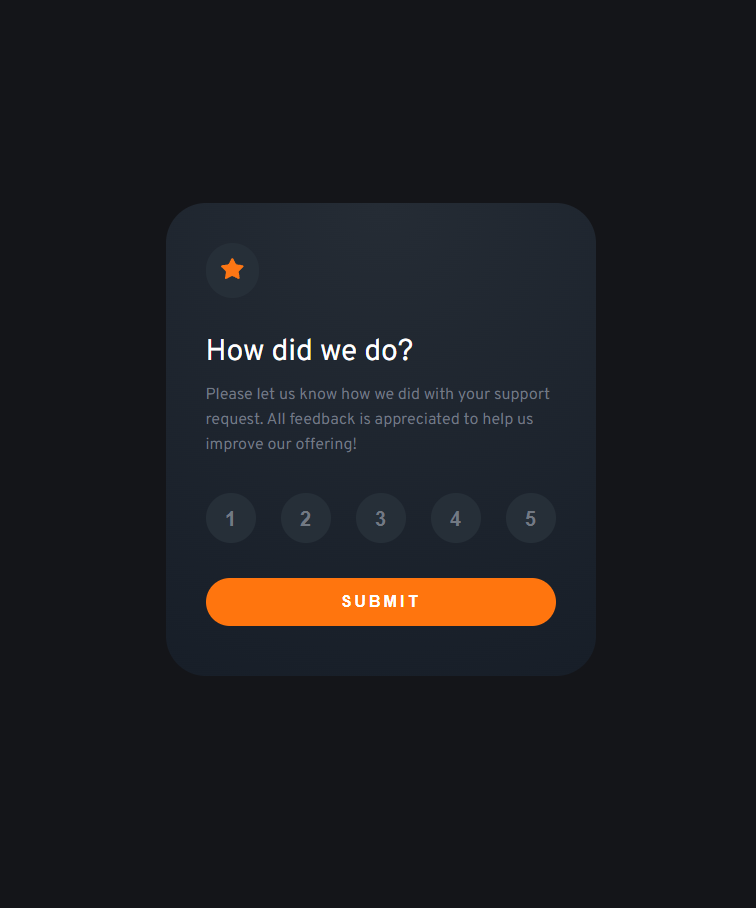
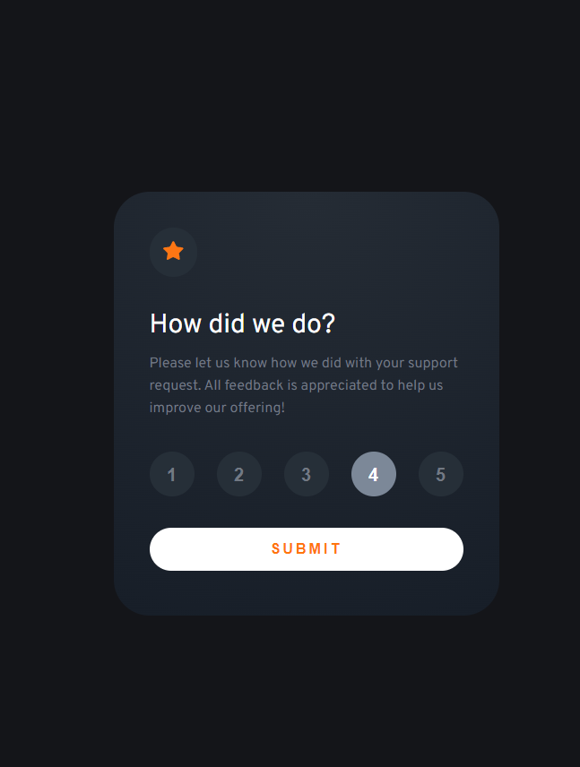
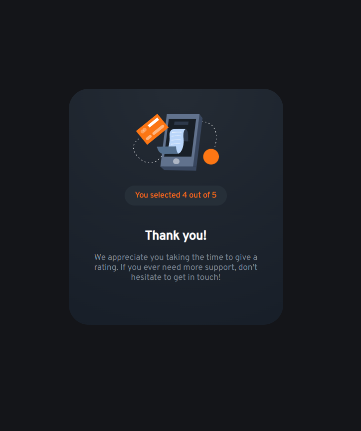

### Interactive Rating Component 

Esta é uma solução para o desafio [Interactive Rating Component](https://www.frontendmentor.io/challenges/interactive-rating-component-koxpeBUmI) do site [Front End Mentor](https://www.frontendmentor.io/challenges), onde você escontra diversos desafios que vão te ajudar a melhorar na área do Front-End.

## Sumário

- [Resumo](#Resumo)
  - [Desafio](#Desafio)
  - [Screenshot](#screenshot)
  - [Link](#link)
- [Processo](#Processo)
  - [Construido com](#construido-com)
  - [O que eu aprendi](#o-que-eu-aprendi)
- [Autor](#autor)

## Resumo

O desafio é construir o projeto e deixá-lo o mais próximo possível do design oferecido. Podendo usar qualquer ferramenta para ajudar a concluir o desafio. O meu objetivo foi desenvolver esse projeto em Vue.JS que é o framework em que eu estou me aprofundando no momento.


### Desafio

Como era a minha segunda vez desenvolvendo um projeto próprio em Vue.Js, foi uma experiência pra lá de desafiadora. Meu objetivo era entender mais sobre os componentes, como eles interagiam enter sí, aprender sobre o uso de dados, métodos, como passar e receber propriedades entre os componentes, entender sobre propriedades e meios de emissão de dados. Me dediquei a tornar o projeto o mais fiel possível ao design que recebi e acredito que obti um ótimo resultado.


### Screenshots

<p align="center"> Home</p>
  <div align="center"></img> </div>

------
<p align="center"> Status Ativos</p>
  <div align="center"></img> </div>
------
  <p align="center"> Finalizado</p>
  <div align="center"></img> </div>
  ------


### Link: https://card-compenent.vercel.app

## Processo

### Construido com

-Vue.JS <br>
-TypeScript <br>
-HTML5 <br>
-CSS3 <br>
-JavaScript <br>

### Principais coisas que aprendi

Enviar dados para um componente filho

```js
   <CardConcluido :valor-esperado='valor' />
```

Receber dados de um elemento pai através de propriedades

```js
    props: {
        valorEsperado: {
            type: Number,
            default: 0,
        }
```

Criar dados que funcionam como variáveis

```js
  data(){
    return{
      hide: false,
      valor: 0
    }
```

Utilizando métodos
```js
methods:{
    Funcao(){
      this.hide = true
    }
```
Enviando dados para o componente pai com o Emit
```js
this.$emit('hide')
```

Recebendo dados emitidos do componente filho
```js
     <Card v-on:hide="Funcao"/>
```

Passando um dado dentro de um emmit 
```js
 this.$emit('valor', { meuValor: this.escolhido } )
```


## Autor

-  Site pessoal - [Nicolas Gabriel](https://www.linkedin.com/in/nicolasgabriiel/)

<div  align="left">

### Planejamento de Projeto


- [x] Enviar imagens
- [x] Redefinir projeto
- [x] Importar reset css
- [x] Criar componente card 
- [x] Importar Fonte
- [x] Estilizar background
- [x] Estruturar componente card
- [x] Estilizar Componente Card
- [x] Criar Elemento Texto
- [x] Estruturar Elemento Texto
- [x] Estilizar Elemento Texto
- [x] Criar Elemento Barra
- [x] Estruturar Elemento Barra
- [x] Estilizar Elemento Barra
- [x] Criar Elemento Botao
- [x] Estruturar Elemento Botao
- [x] Estilizar Elemento Botao
- [x] Definir Metodo de seleção barra
- [x] Definir Método de escolha botao
- [x] Criar Componente mensagem Personalizado
- [x] Estruturar Componente mensagem Personalizado
- [x] Estilizar Componente mensagem Personalizado
- [x] Tornar mensagem reativa
- [x] Criar Componente mensagem
- [x] Estilizar Componente mensagem 
- [x] Estruturar Componente mensagem 
- [x] Ligar as propriedades
- [x] Escrever o Readme
